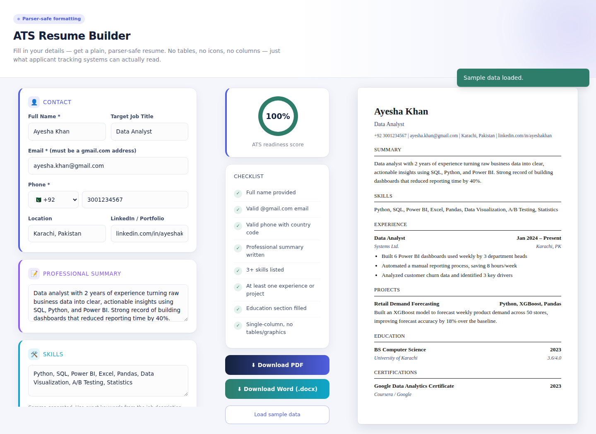
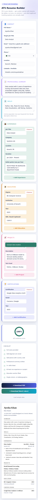

# ATS Resume Builder (Next.js)

A resume builder where anyone can enter their details and export a plain, ATS-parser-safe resume as a **real PDF** or **real Word (.docx)** file — built with Next.js, React state, and Tailwind CSS.

This version was rebuilt from a static HTML prototype because browser preview sandboxes (like in-chat file previews) block `window.print()` and file downloads. Running this as an actual Next.js app in a normal browser tab, or deployed live, avoids that entirely — every button is wired to React state, not fragile inline `onclick` strings.

## Screenshots

| Desktop | Mobile |
|---|---|
|  |  |

## Challenges & Fixes

- **Markdown leaking into exports** — text pasted from AI tools (`**bold**`, `## headers`, `* bullets`) was showing up literally in the downloaded PDF/Word instead of being formatted. Fixed by adding `lib/richtext.js`, a small parser that detects bullets vs. paragraphs and strips stray markdown symbols before rendering — used by both exporters and the live preview, so what you see is what you download.
- **Inline bold/bullets in a real PDF** — `jsPDF` has no built-in rich-text support, so mixed bold/plain words and hanging-indent bullets in `exportPdf.js` are drawn manually: text is split into words, measured, and wrapped word-by-word while tracking style.
- **Cramped, single-tone UI** — the original layout had no gap between grid columns and small, same-colored boxes. Fixed with per-section accent colors, bigger padding, and proper responsive breakpoints (mobile → tablet → desktop).

## Features
- Fully responsive (mobile → desktop), built with Tailwind CSS
- Dynamic Experience / Education / Projects / Certifications sections (add, edit, remove — all React state, no DOM hacks)
- Live ATS-readiness checklist with a score ring
- Country-code phone selector (38 countries) with digit validation
- Email validation (must end in `@gmail.com`)
- Inline field errors + toast notifications, with try/catch around every action
- **Real PDF export** via `jsPDF` (selectable text, not a screenshot)
- **Real Word export** via the `docx` library (proper `.docx`, not an HTML trick)

## Run Locally

You need [Node.js 18+](https://nodejs.org) installed.

```bash
npm install
npm run dev
```

Open [http://localhost:3000](http://localhost:3000).

## Deploy to Vercel (recommended, free)

1. Push this project to a GitHub repo (steps below).
2. Go to [vercel.com/new](https://vercel.com/new), import the repo.
3. Vercel auto-detects Next.js — click **Deploy**. No configuration needed.
4. You'll get a live URL like `https://ats-resume-builder.vercel.app`.

## Push to GitHub

```bash
git init
git add .
git commit -m "Initial commit: ATS resume builder (Next.js)"
git branch -M main
git remote add origin https://github.com/<your-username>/ats-resume-builder.git
git push -u origin main
```

## Project Structure
```
app/
  layout.js       - root layout, fonts
  page.js         - entry point
  globals.css     - Tailwind + print rules
components/
  ResumeBuilder.js - main state + form + layout
  ListSection.js   - reusable add/edit/remove list UI
  Preview.js       - live resume preview
  Checklist.js     - ATS score panel
  Toast.js         - error/success notifications
lib/
  countries.js     - country codes + flags
  validation.js    - email/phone rules
  exportPdf.js     - jsPDF-based PDF generator
  exportWord.js    - docx-based Word generator
```

## Notes
- Email is restricted to `@gmail.com` by design (per requirements). To allow other providers, edit the regex in `lib/validation.js`.
- Phone accepts 6–14 digits after the selected country code — adjust `PHONE_REGEX` in `lib/validation.js` for stricter per-country rules.
